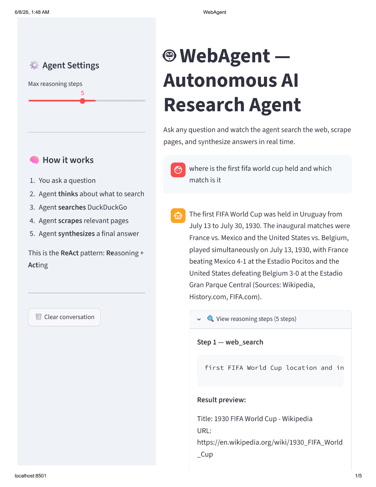
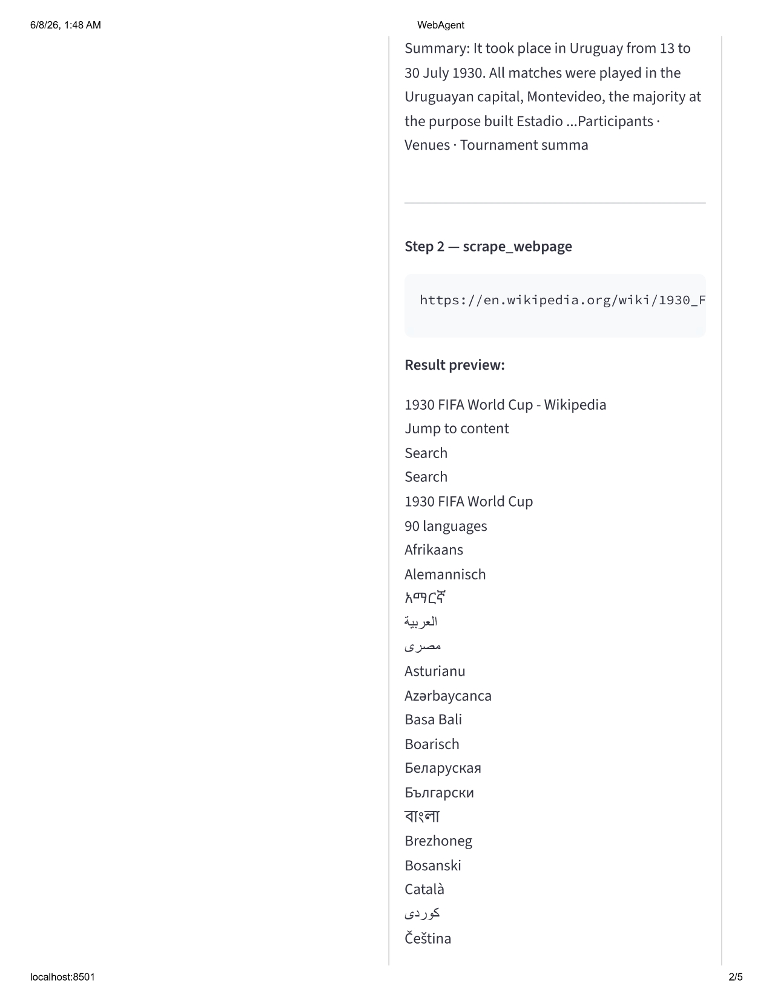
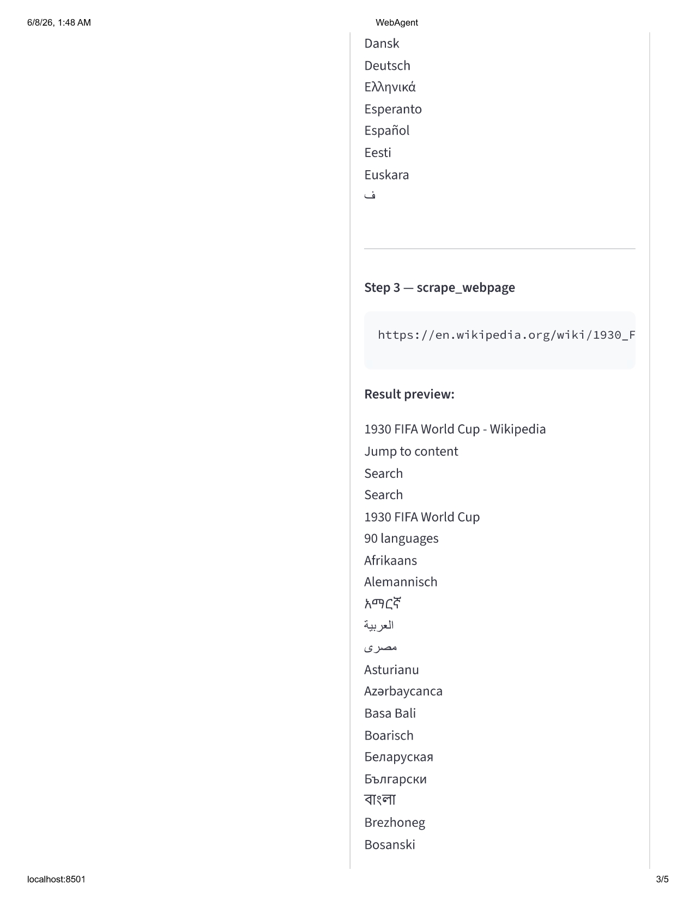
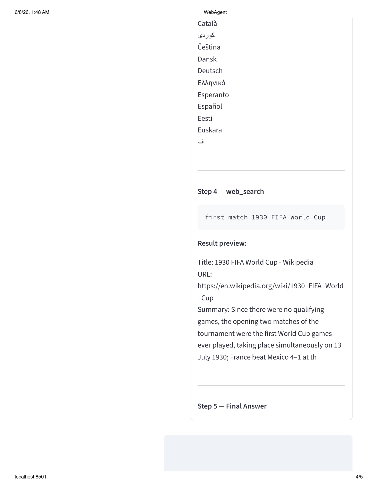

# WebAgent 🤖
### Autonomous AI Research Agent with ReAct Reasoning

> An autonomous AI agent that takes a complex question, independently decides what to search, browses real websites, reasons about what it finds, and synthesizes a comprehensive answer — showing every reasoning step in real time.

---

## The Problem
Most AI assistants answer from training data alone — outdated, unverifiable, no sources.
WebAgent solves this by autonomously searching the live web, reading pages, and synthesizing answers with real citations.

---

## Dashboard

---

## How It Works — ReAct Pattern

~~~
User Question
     │
     ▼
┌─────────────────────────────────┐
│         ReAct Agent Loop        │
│                                 │
│  THOUGHT: reasoning step        │
│     │                           │
│  ACTION: tool selection         │
│     │                           │
│  ┌──┴──────────────────┐        │
│  web_search(query)     │        │
│  scrape_webpage(url)   │        │
│  └────────────────┬────┘        │
│                   │             │
│  OBSERVATION: tool result       │
│     │                           │
│  Repeat until confident         │
│     │                           │
│  FINAL ANSWER: with sources     │
└─────────────────────────────────┘
~~~

---

## Example

**Question:** What are the latest developments in AI agents in 2025?

**Agent Steps:**
1. `web_search("latest developments in AI agents 2025")` 
2. `scrape_webpage("https://intuitionlabs.ai/articles/...")` 
3. Synthesized comprehensive answer with 10 sources

**Completed in 3 steps, ~8 seconds**

---

## Features

- **ReAct reasoning** — agent thinks before every action
- **Web search** — DuckDuckGo search (no API key needed)
- **Web scraping** — reads full page content with BeautifulSoup
- **Conversation memory** — remembers context across turns
- **Reasoning transparency** — every thought and tool call visible in UI
- **Configurable** — adjust max reasoning steps via sidebar slider

---

## Tech Stack

| Component | Technology |
|-----------|------------|
| Agent Framework | Custom ReAct implementation |
| LLM Backend | Groq API (llama-3.3-70b-versatile) |
| Web Search | DuckDuckGo Search (free, no key) |
| Web Scraping | BeautifulSoup + Requests |
| Memory | Custom ConversationMemory |
| UI | Streamlit |

---

## Local Setup

~~~bash
git clone https://github.com/Arin1610/webagent.git
cd webagent
python -m venv venv
venv\Scripts\activate
pip install -r requirements.txt
~~~

Add `.env` file:
~~~
GROQ_API_KEY=your_key_here
~~~

Run the agent:
~~~bash
streamlit run dashboard/app.py
~~~

---

## Project Structure

~~~
webagent/
├── agent/
│   ├── tools.py          ← web search + scraping tools
│   ├── react_agent.py    ← ReAct reasoning loop
│   └── memory.py         ← conversation memory
├── dashboard/
│   └── app.py            ← Streamlit UI
├── .env
├── requirements.txt
└── README.md
~~~

---

## Key Design Decisions

- **Custom ReAct over LangChain AgentExecutor** — built from scratch for full control over reasoning loop and better debugging
- **DuckDuckGo over Google Search API** — free, no API key, sufficient for research tasks
- **llama-3.3-70b** — chosen for superior tool-calling and reasoning over smaller models
- **Conversation memory capped at 10 turns** — balances context retention with token efficiency